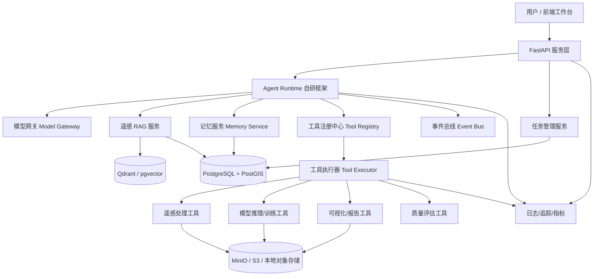
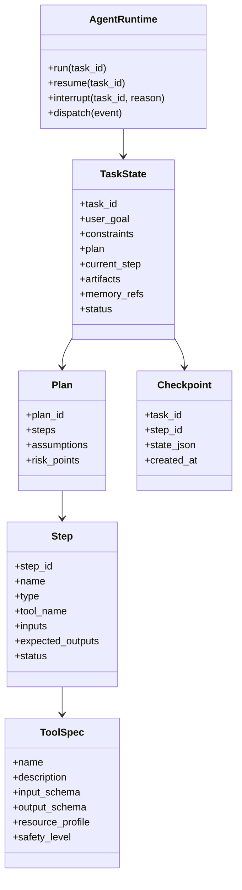
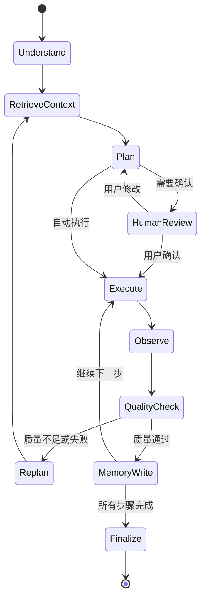
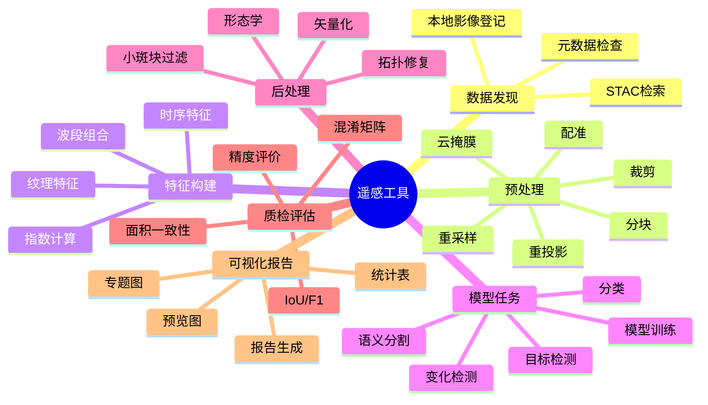
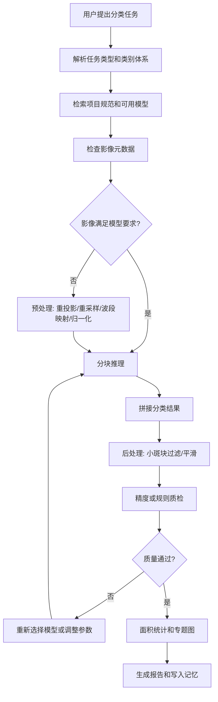
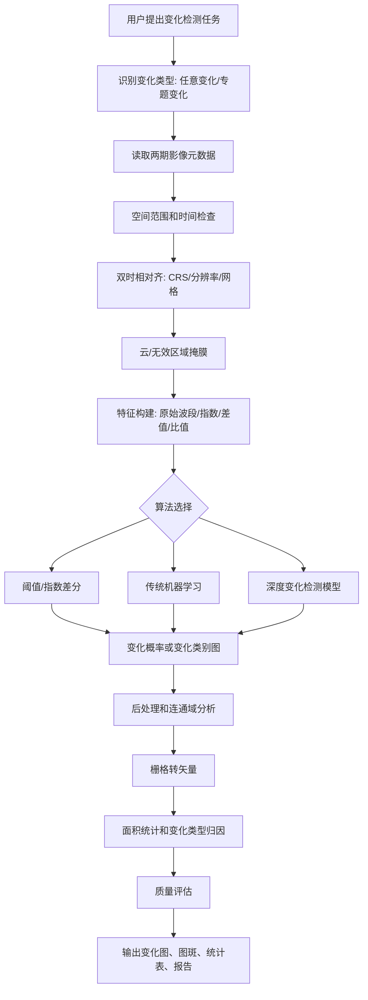
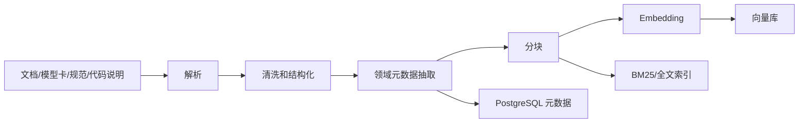
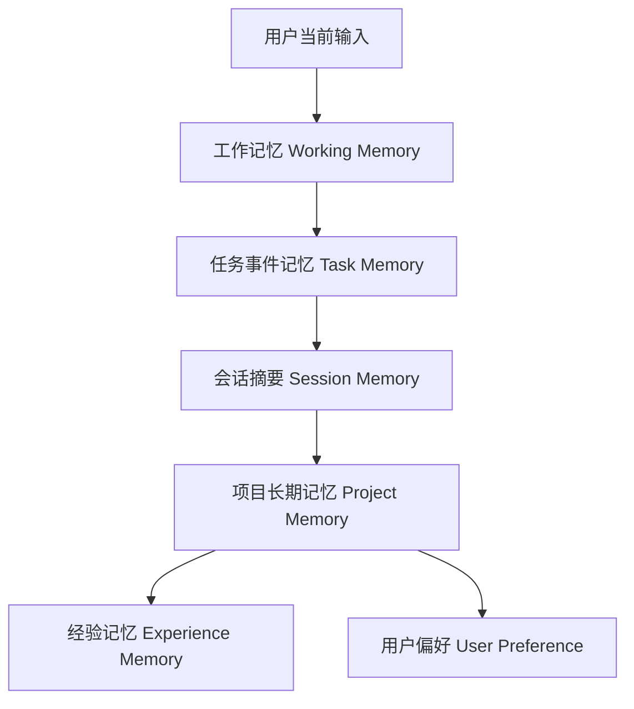
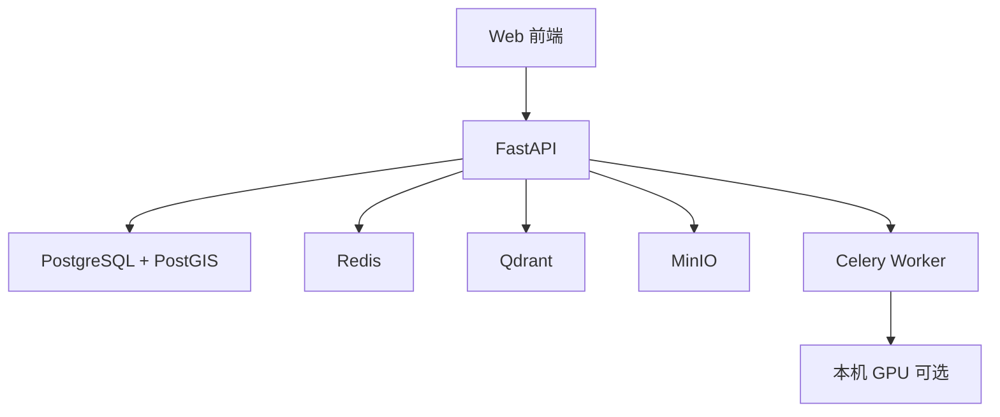
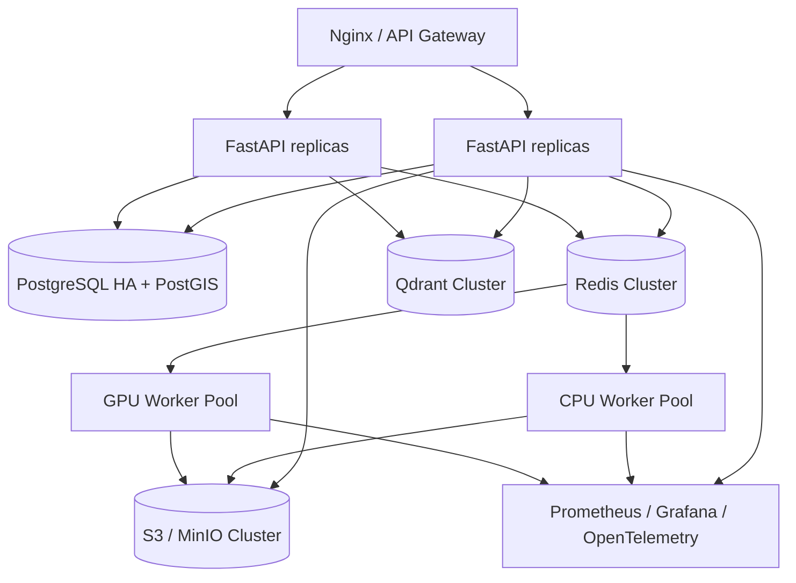

# 遥感任务智能助手技术开发文档

版本：v0.1  
日期：2026-07-06  
定位：面向遥感影像处理、遥感解译与长过程任务自动化的轻量自研智能体系统设计

---

## 1. 项目概述

本项目拟开发一个“遥感任务智能助手”，面向遥感影像分类、变化检测、语义分割、目标提取、影像预处理、结果制图与报告生成等常见任务。系统的核心价值不只是把若干遥感算法封装成工具，而是构建一个能够理解任务目标、拆解长过程流程、调用工具、跟踪状态、恢复执行、利用遥感领域知识并沉淀项目经验的智能体框架。

本方案建议采用“自研轻量 Agent 框架 + 遥感工具插件 + RAG 知识系统 + 分层记忆系统”的架构。自研框架不直接照搬大型开源 Agent 框架，但吸收其成熟思想，例如 LangGraph 的状态图、持久化、人工中断与长任务恢复能力，AutoGen 的事件驱动多智能体协作思想，LlamaIndex 的 RAG 数据摄取、索引、检索与评估经验。

### 1.1 核心目标

1. 支持遥感常见任务：影像分类、变化检测、语义分割、目标检测、指数计算、影像预处理、矢量化与报告生成。
2. 支持长过程任务：自动规划、分阶段执行、可暂停、可恢复、可回滚、可追踪、可人工确认。
3. 支持遥感专业知识 RAG：对传感器、波段、指数、预处理流程、算法适用条件、模型说明、项目规范进行检索增强。
4. 支持工具调用：把遥感数据处理、模型推理、可视化、质检、制图、报告等能力标准化封装为可调用工具。
5. 支持记忆系统：短期任务记忆、长期项目记忆、用户偏好、工具经验、失败经验、数据资产记忆。
6. 支持可扩展：后续可接入更多遥感模型、领域知识库、数据源、调度后端和前端工作台。

### 1.2 设计原则

1. 轻量可控：核心 Agent 框架由项目自研，减少对复杂黑盒框架的依赖。
2. 工程优先：所有工具调用必须有结构化输入、输出、日志、错误码和产物登记。
3. 状态显式：长任务不是一轮对话，而是一组可持久化、可恢复的状态迁移。
4. 遥感原生：充分保留 CRS、仿射变换、波段、分辨率、时相、云量、传感器等遥感元数据。
5. 人机协同：关键节点允许人工确认，例如数据选择、样本检查、阈值选择、结果验收。
6. 可观测：每次计划、检索、工具调用、模型推理、失败重试都应可审计。
7. 可替换：LLM、Embedding、向量库、调度器、模型服务均通过网关或接口抽象。

---

## 2. 需求分析

### 2.1 用户角色

| 角色 | 典型诉求 | 系统支持方式 |
| --- | --- | --- |
| 遥感算法工程师 | 快速搭建处理流程、调试模型、复用工具 | 工具注册、任务 DAG、实验记录、模型管理 |
| 遥感业务分析师 | 用自然语言完成分类、变化检测、统计和出图 | 对话式任务入口、自动规划、报告生成 |
| 项目负责人 | 追踪任务进度、审查结果、复盘质量 | 任务状态面板、审计日志、指标汇总 |
| 数据管理员 | 管理影像、矢量、模型、知识文档 | STAC/数据目录、元数据入库、权限控制 |
| 标注/质检人员 | 检查样本和结果，反馈修正意见 | 人工确认节点、质检工具、记忆写入 |

### 2.2 功能性需求

#### 2.2.1 对话与任务理解

系统应支持用户以自然语言描述遥感任务，例如：

```text
帮我对这两期 Sentinel-2 影像做变化检测，重点关注建设用地扩张，输出变化图斑和面积统计。
```

智能体需要解析：

1. 任务类型：变化检测。
2. 数据类型：两期 Sentinel-2 影像。
3. 目标类别：建设用地扩张。
4. 输出产物：变化栅格、变化图斑、面积统计。
5. 隐含流程：影像检查、配准/重采样、云掩膜、指数/特征构建、模型或算法选择、后处理、矢量化、统计、报告。

#### 2.2.2 遥感影像处理任务

MVP 阶段建议支持以下任务：

| 任务 | MVP 能力 | 后续增强 |
| --- | --- | --- |
| 影像预处理 | 元数据读取、裁剪、重投影、重采样、波段组合、归一化 | 大规模镶嵌、云阴影检测、大气校正流水线 |
| 影像分类 | 基于预训练模型或传统 ML 的地物分类 | 主动学习、样本自动推荐、多模型投票 |
| 变化检测 | 双时相变化检测、阈值法、模型推理、图斑提取 | 多时相趋势分析、对象级变化归因 |
| 语义分割 | 道路、水体、建筑等专题提取 | 多类别解译、边界优化、交互式修正 |
| 指数计算 | NDVI、NDWI、NDBI、EVI 等 | 自定义指数公式、指数时间序列 |
| 结果后处理 | 形态学处理、小斑块过滤、矢量化 | 拓扑修复、规则约束、置信度融合 |
| 统计制图 | 面积统计、行政区汇总、专题图导出 | 自动地图模板、WebGIS 发布 |
| 报告生成 | 任务摘要、参数、结果图、指标、结论 | Word/PDF 模板化、可追溯引用 |

#### 2.2.3 长过程任务处理

系统应支持：

1. 任务拆解：将用户目标拆成可执行步骤。
2. 阶段计划：计划可被用户查看、修改和确认。
3. 状态持久化：每个步骤的输入、输出、日志、错误和产物都写入任务状态。
4. 断点恢复：系统重启或工具失败后从最近 checkpoint 继续。
5. 重试与降级：工具失败时可重试、换工具、请求人工干预。
6. 预算控制：限制 token、时间、GPU、数据扫描范围和费用。
7. 质量门禁：关键阶段完成后执行自动质检。
8. 结果解释：输出不仅包含结果，还包含为什么这样处理。

#### 2.2.4 遥感 RAG

RAG 系统需要支持：

1. 遥感专业文档问答。
2. 任务规划时检索流程规范和算法适用条件。
3. 工具调用前检索工具说明、参数范围和示例。
4. 报告生成时引用项目规范、传感器说明、模型说明。
5. 对数据资产进行空间、时间、传感器、云量、分辨率过滤。

#### 2.2.5 记忆系统

记忆系统需要记录：

1. 当前任务工作记忆：目标、约束、计划、步骤状态、已生成产物。
2. 会话记忆：用户已确认的信息、偏好、临时上下文。
3. 项目长期记忆：常用区域、数据源、模型、阈值、项目 SOP。
4. 工具经验记忆：哪些参数在某类数据上效果好，哪些失败需要规避。
5. 结果复盘记忆：用户对结果的反馈、质检结论、后续修正。

### 2.3 非功能性需求

| 指标 | 要求 |
| --- | --- |
| 可用性 | 单任务失败不影响系统整体；任务可恢复 |
| 性能 | 大影像采用分块、并行和异步任务；避免一次性读入整景 |
| 可扩展 | 工具、模型、知识库、数据源均可插件化扩展 |
| 可审计 | 保存计划、检索证据、工具调用、参数、版本和产物 |
| 安全 | 工具执行隔离；限制文件路径、命令、网络、GPU 资源 |
| 可解释 | 输出任务流程、参数选择依据、质量指标和不确定性 |
| 可部署 | 支持单机开发、Docker Compose、小型私有化部署 |
| 数据合规 | 支持私有影像、内网知识库、本地模型和访问权限控制 |

---

## 3. 总体技术选型

### 3.1 推荐技术栈

| 模块 | 推荐选型 | 说明 |
| --- | --- | --- |
| 后端语言 | Python 3.11+ / 3.12 | 遥感、AI、数据处理生态成熟 |
| Web API | FastAPI | 类型友好、自动 OpenAPI、适合异步任务接口 |
| 自研 Agent 框架 | Python + Pydantic + asyncio | 轻量、可控、便于定义状态和工具协议 |
| LLM 接入 | Model Gateway | 统一封装云模型、本地模型、OpenAI 兼容接口 |
| Embedding | bge-m3 / text-embedding-3 / 领域模型可替换 | 中英文、长文本、私有部署可选 |
| 向量库 | Qdrant 或 pgvector | Qdrant 适合向量检索与过滤；pgvector 适合简化运维 |
| 关系数据库 | PostgreSQL + PostGIS | 任务状态、空间元数据、矢量结果、审计日志 |
| 缓存/队列 | Redis | 会话缓存、轻量队列、锁、任务心跳 |
| 异步任务 | Celery / Dramatiq / Ray | MVP 可用 Celery；大规模并行和 GPU 调度可用 Ray |
| 对象存储 | MinIO / S3 | 存储 GeoTIFF、COG、模型产物、报告 |
| 遥感 IO | GDAL、Rasterio、rioxarray、xarray | 遥感数据读取、重投影、分块、元数据处理 |
| 矢量处理 | GeoPandas、Shapely、pyproj | 矢量裁剪、空间计算、坐标转换 |
| 图像处理 | OpenCV、scikit-image | 形态学、滤波、边缘、连通域、后处理 |
| 深度学习 | PyTorch、TorchGeo | 遥感数据集、采样、变换、模型训练/推理 |
| 模型服务 | FastAPI worker / Triton / TorchServe | MVP 直接 Python worker；生产可独立模型服务 |
| 实验管理 | MLflow | 模型、参数、指标、artifact 管理 |
| 日志追踪 | OpenTelemetry + Prometheus + Grafana | 请求、任务、工具调用、资源指标 |
| 前端 | React / Vue + OpenLayers / MapLibre | 地图浏览、任务面板、人工确认、结果对比 |
| 文档知识处理 | Unstructured / pymupdf / markdown parser | PDF、Markdown、HTML、Word 文档解析 |

### 3.2 自研 Agent 框架与开源框架关系

本项目建议自研核心框架，但参考成熟开源框架的设计：

| 参考框架 | 可借鉴能力 | 本项目落地方式 |
| --- | --- | --- |
| LangGraph | 状态图、持久化、长过程、人工中断、恢复执行 | 自研 `StateGraphRuntime`、`CheckpointStore`、`Interrupt` |
| AutoGen | 多智能体对话、事件驱动、工具协作 | 自研 `AgentRole`、`EventBus`、`MessageEnvelope` |
| LlamaIndex | RAG 摄取、索引、检索、工具/Agent 集成 | 自研 RAG 管线，必要时复用部分组件 |
| Haystack / LangChain | 文档检索、工具调用、链式流程 | 只借鉴接口思想，避免框架过重 |
| CrewAI | 角色分工、任务委派 | 可作为 Prompt/角色设计参考 |

原则：**不把大型 Agent 框架作为系统核心运行时**。原因是遥感长任务需要强状态、强产物管理、强工具隔离和强可追溯，通用 Agent 框架往往抽象较高，后期定制成本可能大于收益。可以在局部模块复用开源库，但核心任务状态机、工具协议、记忆写入和遥感产物管理应自研。

### 3.3 MVP 与生产阶段技术差异

| 层级 | MVP 方案 | 生产增强 |
| --- | --- | --- |
| Agent Runtime | 单进程 asyncio + PostgreSQL checkpoint | 多 worker + 分布式锁 + 调度集群 |
| 工具执行 | Python 函数/子进程 | 容器隔离、资源配额、工具市场 |
| 模型推理 | 本地 PyTorch worker | Triton/TorchServe + GPU 池 |
| RAG | Qdrant + BM25 + rerank | 多索引、知识图谱、评测闭环 |
| 数据管理 | 文件目录 + PostGIS 元数据 | STAC API + COG + 对象存储 |
| 前端 | 简单任务面板 | 地图工作台、人工标注、对比分析 |
| 观测 | 结构化日志 | OpenTelemetry 全链路追踪 |

---

## 4. 系统总体架构

### 4.1 架构分层



### 4.2 核心模块说明

#### 4.2.1 API 服务层

负责：

1. 用户认证与权限。
2. 对话接口。
3. 任务创建、查看、暂停、恢复、取消。
4. 文件上传与数据资产登记。
5. 人工确认节点提交。
6. 结果下载、地图预览、报告查看。

#### 4.2.2 Agent Runtime

自研轻量智能体运行时，是系统核心。负责：

1. 解析用户输入。
2. 维护任务状态。
3. 调用 RAG 和记忆。
4. 生成计划。
5. 调度工具。
6. 观察工具结果。
7. 反思和修正计划。
8. 触发人工确认。
9. 生成最终答复和报告。

#### 4.2.3 RAG 服务

负责：

1. 遥感领域文档摄取。
2. 文本切分、元数据抽取、向量化。
3. 混合检索、重排、引用生成。
4. 数据资产检索，例如按区域、时相、传感器、云量查询影像。
5. 给 Agent 提供带证据的知识上下文。

#### 4.2.4 记忆服务

负责：

1. 当前任务状态记忆。
2. 会话摘要。
3. 项目长期偏好。
4. 工具经验和失败经验。
5. 用户反馈沉淀。

#### 4.2.5 工具注册中心

负责：

1. 工具元数据注册。
2. 工具 schema 管理。
3. 权限和资源需求声明。
4. 工具版本控制。
5. 工具调用前参数校验。

#### 4.2.6 工具执行器

负责：

1. 同步/异步执行工具。
2. 文件路径和对象存储访问控制。
3. 资源限制。
4. 超时、重试、取消。
5. 日志采集。
6. 输出产物登记。

#### 4.2.7 遥感工具层

负责具体遥感处理：

1. 影像读取与元数据解析。
2. 重投影、裁剪、重采样、分块。
3. 指数计算。
4. 分类、分割、变化检测推理。
5. 后处理、矢量化、统计。
6. 可视化和报告。

---

## 5. 自研轻量 Agent 框架设计

### 5.1 核心抽象



### 5.2 任务状态模型

建议使用 Pydantic 定义核心状态：

```python
class Artifact(BaseModel):
    artifact_id: str
    type: Literal["raster", "vector", "table", "image", "report", "model", "log"]
    uri: str
    crs: str | None = None
    bbox: list[float] | None = None
    time_range: tuple[str, str] | None = None
    metadata: dict[str, Any] = {}


class StepState(BaseModel):
    step_id: str
    name: str
    status: Literal["pending", "running", "succeeded", "failed", "skipped", "waiting_human"]
    tool_name: str | None = None
    input_refs: list[str] = []
    output_refs: list[str] = []
    params: dict[str, Any] = {}
    error: dict[str, Any] | None = None
    started_at: datetime | None = None
    finished_at: datetime | None = None


class TaskState(BaseModel):
    task_id: str
    user_id: str
    user_goal: str
    task_type: str | None = None
    status: Literal["created", "planning", "running", "waiting_human", "succeeded", "failed", "cancelled"]
    constraints: dict[str, Any] = {}
    plan: list[StepState] = []
    artifacts: dict[str, Artifact] = {}
    working_memory: dict[str, Any] = {}
    retrieved_context: list[dict[str, Any]] = []
    created_at: datetime
    updated_at: datetime
```

### 5.3 Agent 执行状态图



### 5.4 长过程任务处理机制

#### 5.4.1 Checkpoint

每个关键节点写入 checkpoint：

1. 计划生成后。
2. 每个工具调用前。
3. 每个工具调用成功后。
4. 每个工具调用失败后。
5. 人工确认前后。
6. 最终报告生成前。

Checkpoint 存储内容：

1. `TaskState` 完整 JSON。
2. 当前 step。
3. LLM 输入摘要和输出。
4. RAG 检索结果 ID。
5. 工具调用参数。
6. Artifact 引用。

#### 5.4.2 Event Sourcing

除保存最新状态外，建议保存事件流：

| 事件 | 说明 |
| --- | --- |
| `TaskCreated` | 用户创建任务 |
| `UserMessageReceived` | 用户输入 |
| `ContextRetrieved` | RAG 检索完成 |
| `PlanGenerated` | 计划生成 |
| `HumanInterruptCreated` | 等待人工确认 |
| `ToolCallStarted` | 工具开始 |
| `ToolCallSucceeded` | 工具成功 |
| `ToolCallFailed` | 工具失败 |
| `StepQualityChecked` | 阶段质检 |
| `MemoryWritten` | 记忆写入 |
| `TaskFinalized` | 任务结束 |

这样可以支持审计、回放、恢复和复盘。

#### 5.4.3 工具幂等性

所有工具尽量设计为幂等：

1. 输入相同、参数相同、工具版本相同，输出路径可预测。
2. 若输出已存在且校验通过，可以跳过重复执行。
3. 工具输出必须包含 checksum、工具版本、参数 hash。

#### 5.4.4 失败恢复策略

| 失败类型 | 示例 | 策略 |
| --- | --- | --- |
| 参数错误 | CRS 缺失、波段名错误 | 调用元数据工具补全，重新规划 |
| 数据错误 | 影像损坏、范围不重叠 | 停止并请求人工确认 |
| 资源错误 | 内存不足、GPU 不足 | 切分块、降低 batch、排队重试 |
| 模型错误 | 权重缺失、输入维度不匹配 | 切换模型或请求安装 |
| 质量不达标 | 分类结果噪声大 | 后处理、换阈值、增加人工样本 |
| LLM 计划错误 | 工具选择不合适 | 根据工具错误和 RAG 重新计划 |

### 5.5 Agent 角色设计

为保持轻量，MVP 不必启动多个独立 Agent 进程，可以用一个 Runtime 内的多个角色 prompt 实现。

| 角色 | 职责 | 是否 MVP 必需 |
| --- | --- | --- |
| Coordinator | 总控，维护任务状态，决定下一步 | 是 |
| Planner | 拆解任务、生成步骤和依赖 | 是 |
| RemoteSensingExpert | 提供遥感专业判断 | 是 |
| ToolExecutor | 调用工具并解析结果 | 是 |
| QualityAnalyst | 检查结果质量和指标 | 是 |
| ReportWriter | 生成摘要、报告和说明 | 是 |
| MemoryManager | 判断哪些信息写入长期记忆 | 可后置 |
| DataSteward | 数据资产检索和合规检查 | 可后置 |

### 5.6 计划格式

Agent 生成计划时必须输出结构化 JSON，而不是自由文本：

```json
{
  "task_type": "change_detection",
  "assumptions": [
    "输入为两期已正射校正的多光谱影像",
    "若 CRS 或分辨率不一致，先进行重投影和重采样"
  ],
  "steps": [
    {
      "id": "s1",
      "name": "读取两期影像元数据",
      "tool": "raster.inspect_metadata",
      "inputs": ["image_t1", "image_t2"],
      "params": {},
      "expected_outputs": ["metadata_t1", "metadata_t2"],
      "quality_gate": "metadata_valid"
    },
    {
      "id": "s2",
      "name": "统一空间参考和分辨率",
      "tool": "raster.align_pair",
      "inputs": ["image_t1", "image_t2"],
      "params": {"resampling": "bilinear"},
      "expected_outputs": ["aligned_t1", "aligned_t2"],
      "quality_gate": "pair_aligned"
    }
  ],
  "human_checkpoints": ["after_plan", "before_final_report"]
}
```

### 5.7 工具调用协议

每个工具必须注册为 `ToolSpec`：

```json
{
  "name": "raster.calculate_index",
  "version": "0.1.0",
  "description": "计算常见遥感指数，如 NDVI、NDWI、NDBI",
  "input_schema": {
    "type": "object",
    "required": ["raster_uri", "index_name", "band_mapping"],
    "properties": {
      "raster_uri": {"type": "string"},
      "index_name": {"type": "string", "enum": ["NDVI", "NDWI", "NDBI", "EVI"]},
      "band_mapping": {"type": "object"},
      "output_uri": {"type": "string"}
    }
  },
  "output_schema": {
    "type": "object",
    "properties": {
      "artifact_id": {"type": "string"},
      "stats": {"type": "object"},
      "preview_uri": {"type": "string"}
    }
  },
  "resource_profile": {
    "cpu": 2,
    "memory_gb": 4,
    "gpu": 0,
    "timeout_sec": 900
  },
  "safety_level": "normal"
}
```

工具调用返回：

```json
{
  "ok": true,
  "tool_name": "raster.calculate_index",
  "tool_version": "0.1.0",
  "outputs": {
    "artifact_id": "art_ndvi_001",
    "stats": {"min": -0.31, "max": 0.87, "mean": 0.42},
    "preview_uri": "s3://rs-agent/previews/ndvi_001.png"
  },
  "artifacts": [
    {
      "artifact_id": "art_ndvi_001",
      "type": "raster",
      "uri": "s3://rs-agent/outputs/ndvi_001.tif",
      "crs": "EPSG:32650",
      "bbox": [120.1, 30.1, 120.5, 30.4]
    }
  ],
  "logs": ["read raster ok", "write output ok"],
  "metrics": {"duration_sec": 12.4}
}
```

---

## 6. 遥感工具体系设计

### 6.1 工具分类



### 6.2 MVP 工具清单

#### 数据与元数据工具

| 工具名 | 功能 | 关键输入 | 关键输出 |
| --- | --- | --- | --- |
| `raster.inspect_metadata` | 读取影像元数据 | raster_uri | CRS、bbox、分辨率、波段、nodata、统计 |
| `raster.validate` | 检查影像可用性 | raster_uri | 是否可读、是否有 CRS、是否有 nodata |
| `catalog.register_asset` | 影像资产登记 | uri、metadata | asset_id |
| `catalog.search_assets` | 按空间/时间/传感器检索 | bbox、time、sensor | asset list |

#### 预处理工具

| 工具名 | 功能 | 关键输入 | 关键输出 |
| --- | --- | --- | --- |
| `raster.clip` | 按 bbox 或矢量裁剪 | raster_uri、aoi | clipped raster |
| `raster.reproject` | 重投影 | raster_uri、target_crs | reprojected raster |
| `raster.resample` | 重采样 | raster_uri、resolution | resampled raster |
| `raster.align_pair` | 双时相对齐 | raster_t1、raster_t2 | aligned pair |
| `raster.tile` | 分块 | raster_uri、tile_size、overlap | tile manifest |
| `raster.normalize` | 归一化 | raster_uri、method | normalized raster |
| `raster.cloud_mask` | 云/无效像元掩膜 | raster_uri | mask raster |

#### 特征与指数工具

| 工具名 | 功能 | 关键输入 | 关键输出 |
| --- | --- | --- | --- |
| `raster.calculate_index` | NDVI/NDWI/NDBI/EVI | raster_uri、band_mapping | index raster |
| `raster.stack_bands` | 波段堆叠 | band_uris | multiband raster |
| `raster.texture_features` | 纹理特征 | raster_uri | texture raster |

#### 模型推理工具

| 工具名 | 功能 | 关键输入 | 关键输出 |
| --- | --- | --- | --- |
| `ml.classify_scene` | 影像分类 | raster_uri、model_id | class raster |
| `ml.segment_objects` | 语义分割 | raster_uri、model_id | mask raster |
| `ml.detect_change` | 双时相变化检测 | raster_t1、raster_t2、model_id | change raster |
| `ml.predict_tiles` | 分块推理 | tile_manifest、model_id | tile predictions |
| `ml.merge_tiles` | 合并分块结果 | prediction_manifest | merged raster |

#### 后处理和统计工具

| 工具名 | 功能 | 关键输入 | 关键输出 |
| --- | --- | --- | --- |
| `post.morphology` | 开闭运算、腐蚀膨胀 | raster_uri、operation | cleaned raster |
| `post.filter_small_regions` | 小斑块过滤 | raster_uri、min_area | filtered raster |
| `post.raster_to_vector` | 栅格转矢量 | raster_uri | vector file |
| `post.zonal_stats` | 分区统计 | raster_uri、zone_vector | statistics table |
| `post.area_statistics` | 面积统计 | raster/vector | area table |

#### 可视化与报告工具

| 工具名 | 功能 | 关键输入 | 关键输出 |
| --- | --- | --- | --- |
| `viz.quicklook` | 生成预览图 | raster_uri、bands | png |
| `viz.change_overlay` | 变化叠加图 | base_raster、change_raster | png |
| `viz.map_layout` | 专题图版式 | layer list、style | map image/pdf |
| `report.generate_markdown` | Markdown 报告 | task_state | md |
| `report.generate_pdf` | PDF 报告 | markdown/report data | pdf |

### 6.3 影像分块策略

大影像处理必须采用分块：

1. 默认 tile size：512 或 1024，根据模型输入调整。
2. overlap：语义分割/变化检测建议 32 到 128 像素，减少边缘伪影。
3. 分块 manifest 记录每块的 window、transform、bbox、输出路径。
4. 推理后按权重窗口融合，避免重叠区接缝。
5. 分块失败时只重试失败 tile。

Tile manifest 示例：

```json
{
  "raster_uri": "s3://bucket/image.tif",
  "tile_size": 1024,
  "overlap": 64,
  "tiles": [
    {
      "tile_id": "tile_0001",
      "window": [0, 0, 1024, 1024],
      "bbox": [120.1, 30.1, 120.2, 30.2],
      "uri": "s3://bucket/tiles/tile_0001.tif"
    }
  ]
}
```

### 6.4 遥感元数据规范

所有 raster artifact 至少保存：

| 字段 | 说明 |
| --- | --- |
| `crs` | 坐标参考系统 |
| `transform` | 仿射变换 |
| `width` / `height` | 影像尺寸 |
| `resolution` | 空间分辨率 |
| `bbox` | 空间范围 |
| `band_names` | 波段名称 |
| `band_wavelengths` | 波段中心波长，可选 |
| `nodata` | 无效值 |
| `dtype` | 数据类型 |
| `sensor` | 传感器 |
| `acquired_at` | 成像时间 |
| `cloud_cover` | 云量，可选 |
| `processing_level` | 处理级别 |
| `checksum` | 文件校验 |

### 6.5 模型管理

模型登记表：

| 字段 | 说明 |
| --- | --- |
| `model_id` | 模型 ID |
| `task_type` | classification / segmentation / change_detection |
| `framework` | PyTorch / ONNX / Triton |
| `weights_uri` | 权重地址 |
| `input_bands` | 输入波段要求 |
| `input_resolution` | 分辨率要求 |
| `classes` | 类别定义 |
| `preprocess` | 归一化、裁剪、尺度 |
| `postprocess` | argmax、阈值、CRF、形态学 |
| `metrics` | 验证集指标 |
| `license` | 许可证 |
| `version` | 版本 |

模型选择逻辑：

1. 根据任务类型过滤模型。
2. 根据传感器、波段、分辨率过滤。
3. 根据项目区域、类别体系、历史效果排序。
4. 若无合适模型，降级到传统方法或请求人工选择。

---

## 7. 遥感任务流程设计

### 7.1 影像分类流程



关键判断：

1. 类别体系是否明确，例如耕地、林地、水体、建设用地。
2. 输入影像波段是否满足模型要求。
3. 是否有训练样本或验证样本。
4. 是否需要行政区分区统计。
5. 是否需要输出 GeoTIFF、GeoJSON、Shapefile、PDF 报告。

### 7.2 变化检测流程



变化检测核心质量门禁：

1. 两期影像空间范围重叠率是否足够。
2. CRS、分辨率、像元网格是否一致。
3. 云、阴影、水体季节差异是否影响目标变化。
4. 变化图斑最小面积阈值是否合理。
5. 是否存在明显配准偏差导致的边缘假变化。

### 7.3 长过程任务示例

用户输入：

```text
帮我对杭州市 2022 和 2025 年的 Sentinel-2 影像做建设用地扩张分析，输出新增建设用地图斑、各区面积统计和一份报告。
```

Agent 计划：

1. 检索杭州市 AOI 和行政区边界。
2. 检索 2022、2025 年低云量 Sentinel-2 影像。
3. 让用户确认影像选择。
4. 下载或登记影像。
5. 云掩膜和裁剪。
6. 双时相空间对齐。
7. 计算 NDBI、NDVI、NDWI 等指数。
8. 调用建设用地分类模型分别得到两期建设用地结果。
9. 对两期分类结果做差分，提取新增建设用地。
10. 过滤小斑块，转矢量。
11. 按行政区统计面积。
12. 生成变化叠加图和专题地图。
13. 自动质检，提示可能误差。
14. 生成报告。
15. 写入项目记忆。

此流程中，步骤 3、13 可以设置人工确认；步骤 4 到 12 可以异步执行；每个步骤都有 checkpoint。

---

## 8. RAG 系统设计

### 8.1 知识库类型

| 知识库 | 内容 | 用途 |
| --- | --- | --- |
| 遥感基础知识库 | 波段、指数、传感器、处理级别、误差来源 | 任务理解和解释 |
| 算法知识库 | 分类、分割、变化检测方法说明 | 规划和模型选择 |
| 工具知识库 | 工具 schema、参数、示例、错误处理 | 工具调用 |
| 项目规范库 | 项目 SOP、类别体系、验收标准 | 质量门禁和报告 |
| 模型知识库 | 模型卡、训练数据、适用范围、指标 | 模型选择 |
| 数据资产库 | 影像、矢量、样本、行政区、历史成果 | 数据发现 |
| 案例经验库 | 过去任务、失败原因、调参经验 | 记忆增强 |

### 8.2 RAG 数据摄取流程



### 8.3 文档切分策略

遥感知识不适合只按固定 token 切分，建议采用分层切分：

1. 标题层级切分：保留章节标题路径。
2. 表格单独切分：传感器波段表、参数表、类别表必须保持完整。
3. 算法步骤切分：流程型内容按步骤聚合。
4. 模型卡切分：输入、输出、类别、指标、限制分块。
5. 工具说明切分：一个工具一个主 chunk，参数示例可作为子 chunk。

Chunk 元数据：

```json
{
  "doc_id": "sentinel2_band_spec",
  "chunk_id": "sentinel2_band_spec#bands",
  "title_path": ["Sentinel-2", "MSI Bands"],
  "source_type": "sensor_doc",
  "task_tags": ["classification", "index_calculation", "change_detection"],
  "sensor": "Sentinel-2",
  "band_names": ["B02", "B03", "B04", "B08"],
  "language": "zh",
  "version": "2026-07",
  "access_level": "internal"
}
```

### 8.4 检索策略

推荐采用混合检索：

1. Query rewrite：把用户任务改写为专业检索 query。
2. Metadata filter：按任务类型、传感器、项目、权限过滤。
3. Dense retrieval：向量召回语义相关内容。
4. Sparse retrieval：BM25 召回精确术语，例如 NDBI、B08、EPSG。
5. Rerank：用 cross-encoder 或 LLM 轻量重排。
6. Context packing：按证据重要性和 token 预算打包。
7. Citation：保留文档 ID、标题、段落、版本。

### 8.5 遥感数据资产检索

数据资产检索与普通文本 RAG 不同，需要空间和时间过滤：

```sql
SELECT asset_id, uri, sensor, acquired_at, cloud_cover
FROM raster_assets
WHERE ST_Intersects(footprint, ST_GeomFromGeoJSON(:aoi))
  AND acquired_at BETWEEN :start_date AND :end_date
  AND sensor = :sensor
  AND cloud_cover <= :max_cloud
ORDER BY cloud_cover ASC, acquired_at DESC;
```

对于外部数据源，建议采用 STAC 思路维护影像目录。STAC 使用统一的时空资产描述方式，适合遥感影像发现和云原生数据管理。

### 8.6 RAG 在 Agent 中的使用点

| 阶段 | 检索内容 | 示例 |
| --- | --- | --- |
| 任务理解 | 任务类型、术语、传感器知识 | “建设用地扩张”对应变化检测和分类差分 |
| 规划 | 标准流程、项目 SOP | 变化检测需先做双时相对齐 |
| 工具选择 | 工具说明、参数范围 | `align_pair` 的重采样策略 |
| 模型选择 | 模型卡、适用范围 | 某模型只支持 Sentinel-2 10m RGBNIR |
| 质检 | 验收规范、指标阈值 | 最小图斑面积、IoU 阈值 |
| 报告 | 引用说明、方法解释 | NDVI/NDBI 指数解释 |

### 8.7 RAG 评估

评估维度：

1. Retrieval Recall：正确文档是否被召回。
2. Retrieval Precision：召回内容是否聚焦。
3. Faithfulness：回答是否忠实于检索证据。
4. Planning Helpfulness：检索结果是否改善任务计划。
5. Tool Accuracy：是否帮助选择正确工具和参数。
6. Citation Coverage：关键结论是否有来源。

构建评测集：

```text
Q: Sentinel-2 做 NDVI 应该使用哪些波段？
Expected evidence: Sentinel-2 band spec, B08 NIR, B04 Red.

Q: 双时相变化检测前为什么要空间对齐？
Expected evidence: change detection SOP, registration/alignment section.

Q: 某模型是否支持 Landsat 8？
Expected evidence: model card input sensor section.
```

---

## 9. 记忆系统设计

### 9.1 记忆分层



| 记忆类型 | 生命周期 | 存储 | 内容 |
| --- | --- | --- | --- |
| Working Memory | 单次任务运行中 | TaskState JSON / Redis | 当前目标、计划、上下文、产物 |
| Task Memory | 单个任务永久 | PostgreSQL event log | 步骤、工具调用、日志、结果 |
| Session Memory | 一段对话 | PostgreSQL / Redis | 用户确认、对话摘要 |
| Project Memory | 项目长期 | PostgreSQL + 向量库 | AOI、类别体系、SOP、常用模型 |
| Experience Memory | 跨任务长期 | 向量库 + 结构化表 | 参数经验、失败原因、修正策略 |
| User Preference | 用户长期 | PostgreSQL | 输出格式、语言、常用区域 |

### 9.2 记忆写入策略

不是所有信息都写入长期记忆。建议使用 Memory Manager 做判断：

应写入：

1. 用户明确偏好：例如“以后报告都用中文，面积单位用公顷”。
2. 项目固定规则：例如“本项目建设用地最小图斑面积为 100 平方米”。
3. 工具经验：例如“某模型在高云量区域误检严重”。
4. 成功参数：例如“杭州建设用地变化检测 NDBI 阈值 0.18 效果较好”。
5. 失败复盘：例如“未做配准导致道路边缘大量假变化”。

不应写入：

1. 一次性临时文件路径。
2. 未经确认的 LLM 猜测。
3. 敏感数据内容。
4. 低置信度推断。

### 9.3 记忆检索策略

任务开始时检索：

1. 用户偏好。
2. 项目 SOP。
3. 类似历史任务。
4. 当前 AOI 的历史结果。
5. 相同传感器/模型的经验。

计划调整时检索：

1. 相似失败案例。
2. 工具错误处理说明。
3. 用户过去对类似结果的反馈。

### 9.4 记忆数据结构

```sql
CREATE TABLE memories (
    memory_id UUID PRIMARY KEY,
    user_id TEXT,
    project_id TEXT,
    memory_type TEXT,
    title TEXT,
    content TEXT,
    confidence FLOAT,
    source_task_id UUID,
    tags TEXT[],
    metadata JSONB,
    created_at TIMESTAMP,
    updated_at TIMESTAMP
);
```

向量库 payload：

```json
{
  "memory_id": "uuid",
  "memory_type": "experience",
  "project_id": "project_hangzhou",
  "task_type": "change_detection",
  "sensor": "Sentinel-2",
  "aoi_name": "Hangzhou",
  "confidence": 0.82,
  "created_at": "2026-07-06"
}
```

---

## 10. 数据管理与存储设计

### 10.1 数据存储分层

| 数据 | 存储 | 说明 |
| --- | --- | --- |
| 原始影像 | MinIO/S3/文件系统 | 建议 COG 或 GeoTIFF |
| 中间影像 | MinIO/S3 | 裁剪、重采样、指数、分块 |
| 结果影像 | MinIO/S3 | 分类图、变化图 |
| 矢量结果 | PostGIS + 文件 | GeoJSON、GPKG、Shapefile |
| 任务状态 | PostgreSQL | 当前状态和 checkpoint |
| 事件日志 | PostgreSQL | 任务事件流 |
| 文档知识 | 对象存储 + 向量库 | 原文和 chunk |
| 向量索引 | Qdrant / pgvector | RAG 和记忆 |
| 模型权重 | MinIO/S3 | 权重、模型卡 |
| 预览图/报告 | MinIO/S3 | PNG、PDF、Markdown |

### 10.2 数据库表设计

#### 任务表

```sql
CREATE TABLE tasks (
    task_id UUID PRIMARY KEY,
    user_id TEXT NOT NULL,
    project_id TEXT,
    task_type TEXT,
    title TEXT,
    user_goal TEXT,
    status TEXT,
    state JSONB,
    created_at TIMESTAMP,
    updated_at TIMESTAMP
);
```

#### 事件表

```sql
CREATE TABLE task_events (
    event_id UUID PRIMARY KEY,
    task_id UUID REFERENCES tasks(task_id),
    event_type TEXT NOT NULL,
    payload JSONB,
    created_at TIMESTAMP
);
```

#### 产物表

```sql
CREATE TABLE artifacts (
    artifact_id UUID PRIMARY KEY,
    task_id UUID REFERENCES tasks(task_id),
    artifact_type TEXT,
    uri TEXT,
    crs TEXT,
    bbox GEOMETRY(POLYGON, 4326),
    time_range TSTZRANGE,
    metadata JSONB,
    checksum TEXT,
    created_at TIMESTAMP
);
```

#### 影像资产表

```sql
CREATE TABLE raster_assets (
    asset_id UUID PRIMARY KEY,
    uri TEXT NOT NULL,
    sensor TEXT,
    product_level TEXT,
    acquired_at TIMESTAMP,
    cloud_cover FLOAT,
    crs TEXT,
    resolution FLOAT,
    footprint GEOMETRY(POLYGON, 4326),
    bands JSONB,
    metadata JSONB,
    created_at TIMESTAMP
);

CREATE INDEX idx_raster_assets_footprint
ON raster_assets USING GIST (footprint);
```

#### 模型表

```sql
CREATE TABLE models (
    model_id TEXT PRIMARY KEY,
    name TEXT,
    task_type TEXT,
    framework TEXT,
    weights_uri TEXT,
    input_spec JSONB,
    output_spec JSONB,
    metrics JSONB,
    model_card TEXT,
    version TEXT,
    created_at TIMESTAMP
);
```

### 10.3 文件命名规范

建议产物路径：

```text
s3://rs-agent/
  projects/{project_id}/
    tasks/{task_id}/
      inputs/
      intermediate/
        s01_metadata/
        s02_aligned/
        s03_features/
      outputs/
        rasters/
        vectors/
        previews/
        reports/
      logs/
```

---

## 11. API 设计草案

### 11.1 对话与任务

| Method | Path | 说明 |
| --- | --- | --- |
| `POST` | `/api/chat` | 对话入口，可创建或继续任务 |
| `POST` | `/api/tasks` | 创建任务 |
| `GET` | `/api/tasks/{task_id}` | 获取任务状态 |
| `POST` | `/api/tasks/{task_id}/resume` | 恢复任务 |
| `POST` | `/api/tasks/{task_id}/pause` | 暂停任务 |
| `POST` | `/api/tasks/{task_id}/cancel` | 取消任务 |
| `GET` | `/api/tasks/{task_id}/events` | 获取事件流 |
| `GET` | `/api/tasks/{task_id}/artifacts` | 获取产物 |

### 11.2 人工确认

| Method | Path | 说明 |
| --- | --- | --- |
| `GET` | `/api/tasks/{task_id}/interrupts` | 查看待确认项 |
| `POST` | `/api/tasks/{task_id}/interrupts/{interrupt_id}/approve` | 确认 |
| `POST` | `/api/tasks/{task_id}/interrupts/{interrupt_id}/revise` | 修改计划或参数 |
| `POST` | `/api/tasks/{task_id}/interrupts/{interrupt_id}/reject` | 拒绝并要求重规划 |

### 11.3 工具与模型

| Method | Path | 说明 |
| --- | --- | --- |
| `GET` | `/api/tools` | 工具列表 |
| `GET` | `/api/tools/{tool_name}` | 工具详情 |
| `POST` | `/api/tools/{tool_name}/dry-run` | 参数校验，不执行 |
| `GET` | `/api/models` | 模型列表 |
| `GET` | `/api/models/{model_id}` | 模型详情 |

### 11.4 数据资产

| Method | Path | 说明 |
| --- | --- | --- |
| `POST` | `/api/assets/upload` | 上传影像或矢量 |
| `POST` | `/api/assets/register` | 登记已有对象存储文件 |
| `POST` | `/api/assets/search` | 按空间、时间、传感器检索 |
| `GET` | `/api/assets/{asset_id}` | 资产详情 |

### 11.5 RAG 与记忆

| Method | Path | 说明 |
| --- | --- | --- |
| `POST` | `/api/knowledge/ingest` | 知识文档入库 |
| `POST` | `/api/knowledge/search` | 知识检索 |
| `GET` | `/api/memories` | 查看记忆 |
| `POST` | `/api/memories` | 写入记忆 |
| `DELETE` | `/api/memories/{memory_id}` | 删除记忆 |

---

## 12. 后端工程结构建议

```text
rs_agent/
  app/
    main.py
    api/
      chat.py
      tasks.py
      assets.py
      tools.py
      knowledge.py
      memories.py
    core/
      config.py
      logging.py
      security.py
    agent/
      runtime.py
      state.py
      planner.py
      prompts.py
      graph.py
      interrupts.py
      checkpoint.py
      events.py
    llm/
      gateway.py
      providers/
        openai_compatible.py
        local_vllm.py
        mock.py
    rag/
      ingest.py
      chunking.py
      embeddings.py
      retriever.py
      reranker.py
      citations.py
    memory/
      service.py
      policies.py
      summarizer.py
    tools/
      registry.py
      executor.py
      schemas.py
      raster/
        metadata.py
        preprocess.py
        indices.py
        tiling.py
      ml/
        inference.py
        change_detection.py
        classification.py
      postprocess/
        morphology.py
        vectorize.py
        statistics.py
      visualization/
        quicklook.py
        maps.py
      report/
        markdown.py
        pdf.py
    storage/
      db.py
      object_store.py
      vector_store.py
      repositories.py
    workers/
      celery_app.py
      tasks.py
    tests/
      unit/
      integration/
      fixtures/
```

---

## 13. Prompt 与结构化输出设计

### 13.1 系统提示词原则

Agent 提示词需要明确：

1. 你是遥感任务助手，不是纯聊天机器人。
2. 遇到遥感任务，必须先识别任务类型、输入数据、输出目标和约束。
3. 复杂任务必须先生成结构化计划。
4. 不得编造影像元数据，必须调用工具检查。
5. 不得直接假设 CRS、分辨率、波段映射。
6. 工具调用前必须校验参数。
7. 关键不确定性必须请求人工确认。
8. 最终结果必须说明方法、参数、产物和质量限制。

### 13.2 Planner 输出 Schema

```json
{
  "task_type": "classification | change_detection | segmentation | preprocessing | report",
  "confidence": 0.0,
  "missing_information": [],
  "assumptions": [],
  "steps": [],
  "human_checkpoints": [],
  "risks": [],
  "estimated_resources": {
    "time_minutes": 0,
    "gpu_required": false,
    "storage_gb": 0
  }
}
```

### 13.3 Quality Analyst 输出 Schema

```json
{
  "passed": true,
  "score": 0.86,
  "checks": [
    {
      "name": "pair_alignment",
      "passed": true,
      "details": "两期影像 CRS 和像元网格一致"
    }
  ],
  "issues": [],
  "recommended_actions": []
}
```

---

## 14. 前端工作台设计

### 14.1 MVP 页面

1. 对话任务页：左侧对话，右侧任务计划和状态。
2. 地图预览页：显示输入影像、分类结果、变化结果、矢量图斑。
3. 人工确认页：确认数据选择、计划、阈值、结果。
4. 产物页：下载 GeoTIFF、GeoJSON、统计表、报告。
5. 知识库管理页：上传文档、查看索引状态。

### 14.2 交互重点

1. 计划可编辑：用户可修改步骤、参数、输出格式。
2. 进度可见：每个步骤显示状态、耗时、日志摘要。
3. 地图可对比：双时相左右对比、滑动卷帘、变化高亮。
4. 结果可反馈：用户可标记误检、漏检，写入经验记忆。

---

## 15. 部署架构

### 15.1 单机 MVP



适用：

1. 原型验证。
2. 小规模项目。
3. 单机 GPU 推理。
4. 内网演示。

### 15.2 生产部署



### 15.3 资源建议

MVP：

| 组件 | 配置 |
| --- | --- |
| API | 4C 8G |
| Worker | 8C 32G |
| GPU | 1 张 12G+ 显存 GPU，可选 |
| PostgreSQL | 4C 16G |
| MinIO | 1TB 起 |
| Qdrant | 4C 16G |

生产：

| 组件 | 配置 |
| --- | --- |
| API | 2 到 4 副本，每副本 4C 8G |
| CPU Worker | 根据影像并发扩展 |
| GPU Worker | 按模型并发扩展 |
| PostgreSQL | 主从或云托管，开启 PostGIS |
| 对象存储 | 独立高可用存储 |
| 向量库 | 独立节点或集群 |

---

## 16. 安全与权限

### 16.1 工具安全

1. 工具只能访问任务授权目录和对象存储 URI。
2. 禁止任意 shell 命令作为工具直接暴露给 LLM。
3. 每个工具声明资源上限和超时时间。
4. 高风险工具必须人工确认，例如删除文件、覆盖原始数据。
5. 模型生成的代码默认不执行；如需执行，必须进入沙箱。

### 16.2 数据权限

1. 项目级权限：用户只能访问所属项目资产。
2. 资产级权限：敏感影像、样本、报告可独立授权。
3. 知识库权限：RAG 检索必须带 access filter。
4. 记忆权限：用户记忆、项目记忆、全局经验记忆分开。

### 16.3 审计

审计内容：

1. 谁创建了任务。
2. 使用了哪些输入数据。
3. 调用了哪些工具。
4. 使用了哪些模型和版本。
5. 生成了哪些产物。
6. 用户在哪些节点确认或修改。
7. 失败和重试记录。

---

## 17. 质量评估体系

### 17.1 遥感结果质量

| 任务 | 指标 |
| --- | --- |
| 分类 | Overall Accuracy、Kappa、F1、每类 Precision/Recall |
| 分割 | IoU、mIoU、Dice、边界质量 |
| 变化检测 | F1、IoU、漏检率、误检率、面积偏差 |
| 预处理 | CRS 一致性、分辨率一致性、重叠率、nodata 比例 |
| 矢量化 | 拓扑有效性、小斑块比例、面积一致性 |

### 17.2 Agent 质量

| 维度 | 指标 |
| --- | --- |
| 任务理解 | task_type 准确率、缺失信息识别率 |
| 计划质量 | 步骤完整性、顺序正确率、人工修改次数 |
| 工具调用 | 参数正确率、工具成功率、重试次数 |
| 长任务能力 | 断点恢复成功率、失败自修复率 |
| RAG | 召回率、引用准确率、幻觉率 |
| 用户体验 | 用户确认次数、任务完成时长、满意度 |

### 17.3 自动测试

测试分层：

1. 单元测试：工具函数、schema 校验、状态迁移。
2. 集成测试：完整任务小样例跑通。
3. 回归测试：固定影像和固定预期结果。
4. RAG 测试：问题集检索和回答评估。
5. Agent 测试：模拟用户任务，检查计划和工具调用。
6. 性能测试：大影像分块、并发任务、GPU 推理。

---

## 18. 开发里程碑

### Phase 0：技术验证，2 到 3 周

目标：证明“自然语言任务 -> 计划 -> 工具调用 -> 产物输出”可行。

交付：

1. FastAPI 基础服务。
2. Agent Runtime 最小状态机。
3. 3 到 5 个遥感工具：元数据读取、裁剪、指数计算、预览图、报告。
4. PostgreSQL 任务表和 artifact 表。
5. 简单 RAG 检索。
6. 一个端到端 Demo：计算 NDVI 并生成报告。

### Phase 1：MVP，6 到 8 周

目标：支持影像分类和变化检测两个核心任务。

交付：

1. 完整工具注册中心和执行器。
2. Checkpoint 和事件流。
3. 分类工具链。
4. 变化检测工具链。
5. RAG 知识库摄取和混合检索。
6. 记忆服务第一版。
7. 前端任务面板和地图预览。
8. 端到端 Demo：建设用地扩张分析。

### Phase 2：工程化增强，8 到 12 周

目标：提升稳定性、可观测性、模型管理和人机协同。

交付：

1. 人工确认节点。
2. 模型管理和模型卡。
3. 分块并行推理。
4. 结果质检体系。
5. MLflow 实验记录。
6. OpenTelemetry 追踪。
7. 项目级权限。
8. 报告模板化。

### Phase 3：平台化，持续迭代

目标：支持多项目、多数据源、多模型和可扩展生态。

交付：

1. STAC 数据目录。
2. 工具插件机制。
3. 多 Agent 角色协作。
4. 主动学习和交互式修正。
5. 知识图谱或空间知识增强。
6. 多模态 RAG。
7. Kubernetes 部署。

---

## 19. 关键风险与应对

| 风险 | 表现 | 应对 |
| --- | --- | --- |
| LLM 幻觉 | 编造影像元数据、错误波段 | 元数据必须工具读取；RAG 带引用；结构化校验 |
| 遥感数据差异大 | 模型泛化差 | 模型卡约束、数据适配、人工确认、可微调 |
| 长任务易失败 | 中途断开、GPU 错误 | checkpoint、事件流、幂等工具、分块重试 |
| 工具不可控 | 参数错误或覆盖文件 | schema 校验、沙箱、输出路径管理 |
| RAG 噪声 | 检索无关文档 | 元数据过滤、rerank、评测集 |
| 结果难验收 | 用户不知道是否可信 | 自动质检、置信度图、样本抽查、报告限制说明 |
| 工程过重 | 前期开发慢 | MVP 聚焦分类和变化检测，不提前做复杂平台 |

---

## 20. 推荐优先实现的最小闭环

为了快速体现“智能”和“遥感价值”，建议最小闭环如下：

1. 用户上传两期影像或选择已登记资产。
2. 用户用自然语言提出变化检测任务。
3. Agent 读取元数据，不猜测数据属性。
4. Agent 检索变化检测 SOP 和模型卡。
5. Agent 生成结构化计划并让用户确认。
6. 系统自动执行：对齐、指数计算、变化检测、后处理、统计。
7. 中途每步写 checkpoint 和 artifact。
8. 结果生成预览图、变化矢量、面积统计表、Markdown 报告。
9. 用户反馈结果质量。
10. 系统把反馈写入项目记忆。

这个闭环能同时展示：

1. 遥感工具能力。
2. 长过程任务能力。
3. RAG 专业知识能力。
4. 记忆系统能力。
5. 可追踪可恢复的工程化能力。

---

## 21. 官方资料与参考链接

以下资料用于本方案的技术选型和架构参考：

1. LangGraph 官方文档：状态化、长过程、持久化、人工中断、记忆等 Agent 编排能力。  
   https://docs.langchain.com/oss/python/langgraph/overview
2. AutoGen 官方文档：单智能体/多智能体、事件驱动和工具扩展设计参考。  
   https://microsoft.github.io/autogen/stable/
3. LlamaIndex 官方文档：RAG 摄取、索引、检索、Agent 状态和工具集成参考。  
   https://developers.llamaindex.ai/python/framework/
4. GDAL 官方文档：栅格与矢量地理空间数据格式读写、命令行工具和数据模型。  
   https://gdal.org/en/stable/
5. Rasterio 官方文档：Python 访问和处理地理栅格数据。  
   https://rasterio.readthedocs.io/en/stable/
6. TorchGeo 官方文档：PyTorch 生态下的遥感/地理空间深度学习数据集、采样、变换和模型能力。  
   https://docs.torchgeo.org/en/stable/
7. STAC 官方站点：时空资产目录规范，适合遥感影像数据发现与资产管理。  
   https://stacspec.org/en/
8. Qdrant 官方文档：向量数据库和检索服务。  
   https://qdrant.tech/documentation/
9. PostGIS 官方文档：PostgreSQL 空间扩展，适合空间资产、矢量结果和空间查询。  
   https://postgis.net/documentation/
10. FastAPI 官方文档：Python API 服务框架。  
   https://fastapi.tiangolo.com/
11. MLflow 官方文档：模型、实验、指标和 artifact 管理。  
   https://mlflow.org/docs/latest/index.html
12. Ray 官方文档：分布式任务、并行计算和可扩展执行参考。  
   https://docs.ray.io/en/latest/

---

## 22. 附录：首批工具开发优先级

| 优先级 | 工具 | 原因 |
| --- | --- | --- |
| P0 | `raster.inspect_metadata` | 所有任务的基础，防止 LLM 猜测 |
| P0 | `raster.clip` | 常见 AOI 处理 |
| P0 | `raster.align_pair` | 变化检测必需 |
| P0 | `raster.calculate_index` | 分类和变化检测常用特征 |
| P0 | `viz.quicklook` | 人工确认和结果展示 |
| P0 | `report.generate_markdown` | 最小结果交付 |
| P1 | `ml.detect_change` | 核心任务 |
| P1 | `ml.classify_scene` | 核心任务 |
| P1 | `post.raster_to_vector` | 图斑输出 |
| P1 | `post.area_statistics` | 业务价值明显 |
| P1 | `post.filter_small_regions` | 提升结果质量 |
| P2 | `ml.train_classifier` | 后续项目定制 |
| P2 | `catalog.search_assets` | 数据资产规模化后重要 |
| P2 | `viz.map_layout` | 报告和制图增强 |

---

## 23. 附录：Agent Runtime 伪代码

```python
async def run_task(task_id: str) -> TaskState:
    state = await checkpoint_store.load_latest(task_id)

    while not state.is_finished:
        await checkpoint_store.save(state)

        if state.status == "created":
            state = await understand_user_goal(state)
            continue

        if state.status == "planning":
            context = await rag.retrieve_for_planning(state)
            memories = await memory.retrieve_relevant(state)
            plan = await planner.generate_plan(state, context, memories)
            state.attach_plan(plan)

            if plan.requires_human_review:
                state.status = "waiting_human"
                await interrupts.create_plan_review(state)
            else:
                state.status = "running"
            continue

        if state.status == "waiting_human":
            return state

        if state.status == "running":
            step = state.next_pending_step()

            if step is None:
                state.status = "finalizing"
                continue

            try:
                await events.emit("ToolCallStarted", task_id, step)
                result = await tool_executor.execute(step.tool_name, step.params)
                state.apply_tool_result(step.step_id, result)
                await events.emit("ToolCallSucceeded", task_id, result)
            except ToolError as exc:
                state.record_error(step.step_id, exc)
                recovery = await planner.recover_from_error(state, exc)
                state.apply_recovery(recovery)
            continue

        if state.status == "finalizing":
            qa = await quality_analyst.evaluate(state)
            if not qa.passed and qa.recommended_actions:
                state.apply_replan(qa.recommended_actions)
                state.status = "running"
                continue

            report = await report_writer.generate(state)
            state.attach_artifact(report)
            await memory.write_from_task(state)
            state.status = "succeeded"

    await checkpoint_store.save(state)
    return state
```

---

## 24. 结论

本系统的关键不在于“让 LLM 调几个遥感函数”，而在于把遥感任务工程化为可计划、可执行、可恢复、可质检、可解释、可沉淀经验的长过程智能体系统。建议从变化检测和影像分类两个高价值场景切入，以自研轻量 Agent Runtime 为核心，优先实现状态图、checkpoint、工具协议、RAG 和记忆系统的最小闭环。只要最小闭环设计扎实，后续扩展到更多遥感任务、多模型、多数据源和平台化工作台会自然顺很多。
